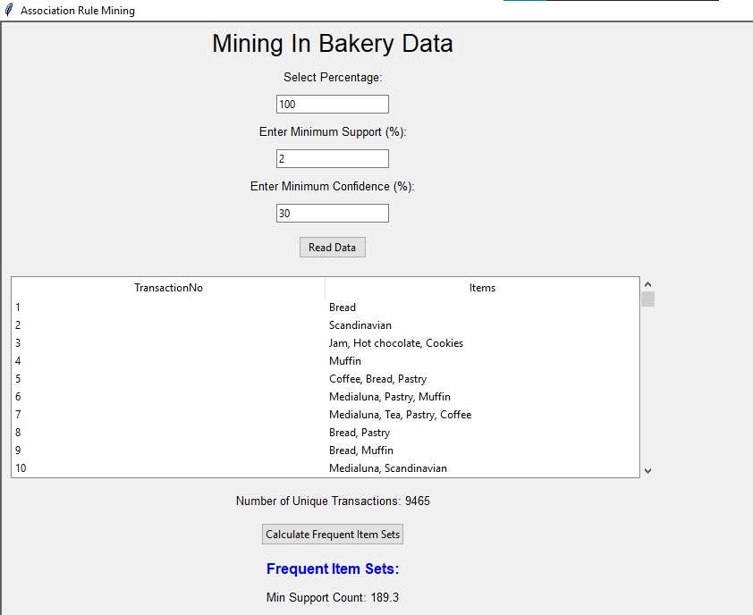
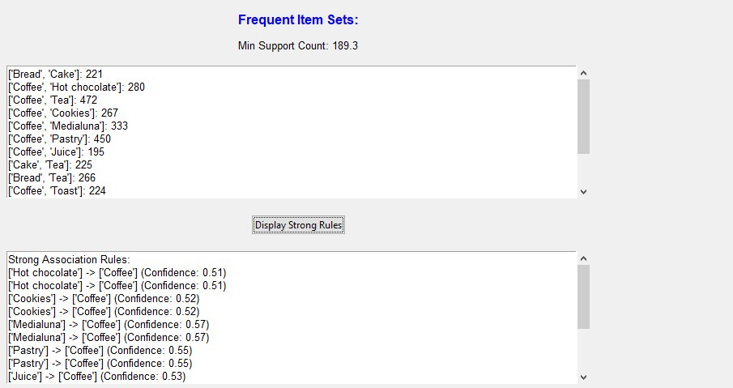

# Apriori Algorithm

## Description
This program implements the Apriori algorithm to analyze a set of transactions from a bakery. The transactions are stored in the "Bakery.csv" file, where each transaction represents a set of items defined with their names at a specific time. Each item is listed in a separate row within a transaction.

The objective is to discover associations between items in the transactions.

## Requirements
- Program in Python that implements the Apriori algorithms on the given set of transactions.
- The user should input the minimum support and minimum confidence values during runtime.
- Generate all association rules that can be mined from the transactions.
- The final output of the program should display the frequent item sets and association rules with their respective confidence values.

## Instructions
1. Your program should have a user-friendly interface.
2. The interface should allow the user to select the percentage of data to be analyzed from the input file. For example, if the file contains 100 records and the user wants to analyze 70% of the data, the analysis should be performed on 70 records only.
3. Write a program in your preferred programming language with the following specifications:

   - Inputs:
     - Excel, text, or CSV file.
     - Minimum support count.
     - Minimum confidence (percentage value).
   - Outputs:
     - The frequent item sets.
     - The strong association rules.

## UI images

